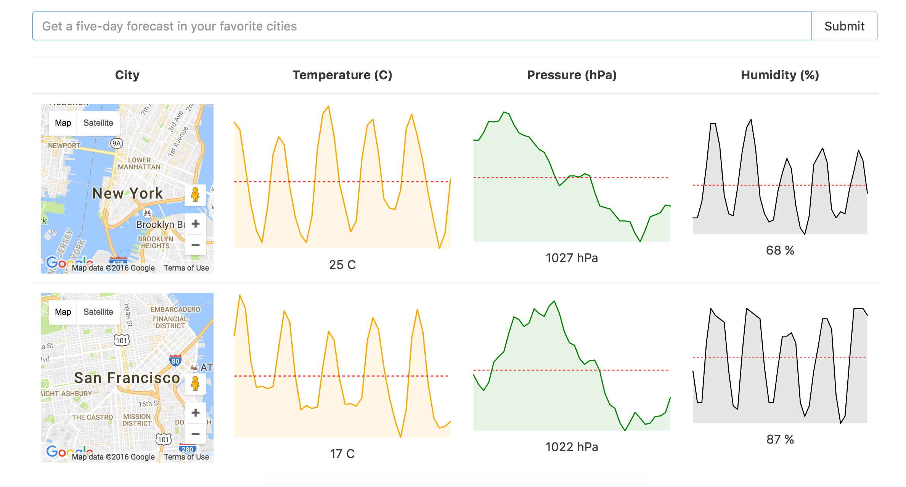

### React Redux Weather Data Charts

* * *

**Prerequisite (api key):**

1. Sign up for an [Open Weather Map](http://openweathermap.org/api) API key.
2. Replace `'YOUR API KEY'` on line 3 in `src/actions/index.js` with your api key.
  - note: make sure to enter your api key *as a string*

```javascript
  const API_KEY='YOUR API KEY';
```



